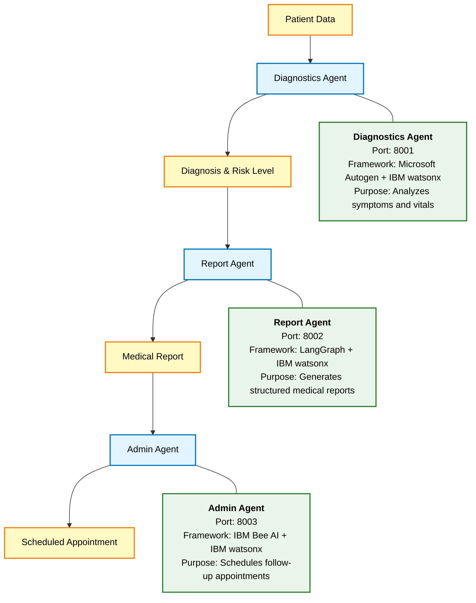
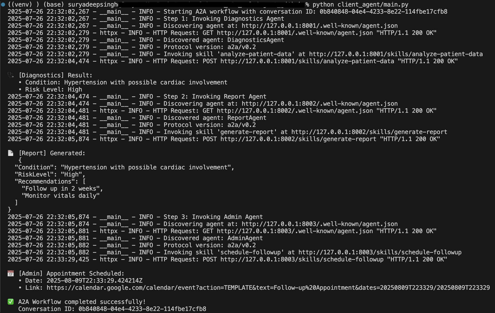

# 🏥 Healthcare Multi-Agent System with Google Agent2Agent(A2A) Protocol, IBM-watsonx and Agentic Frameworks - Autogen, LangGraph, IBM BeeAI 

A sophisticated multi-agent healthcare system that orchestrates AI agents to analyze patient data, generate medical reports, and schedule follow-up appointments using the A2A (Agent-to-Agent) protocol and IBM watsonx.


## 🌟 Overview

This project demonstrates a distributed multi-agent system for healthcare workflow automation following the A2A protocol. The system seamlessly integrates three specialized AI agents powered by IBM watsonx and various AI frameworks to create an end-to-end healthcare automation pipeline.

### 🎯 Key Features

- **Protocol-Based Communication**: Full A2A compliance with JSON-RPC 2.0
- **Multi-Framework Integration**: Combines Autogen, LangGraph, and BeeAI frameworks
- **Distributed Architecture**: Independently deployable microservices
- **Healthcare Workflow Automation**: From diagnosis to appointment scheduling
- **Real-time Processing**: Asynchronous operations with comprehensive error handling

## 🏗️ Folder Structure

```
healthcare_a2a_multiagent/
│
├── client_agent/          # Orchestrator agent (A2A Client)
│   └── workflow_client.py # Multi-agent workflow coordinator
│
├── diagnostics_agent/     # Medical diagnosis service
│   ├── server.py         # A2A-compliant REST API
│   └── diagnostics_logic.py # Autogen-based analysis
│
├── report_agent/         # Report generation service
│   ├── server.py        # A2A-compliant REST API
│   └── report_logic.py  # LangGraph-based generation
│
├── admin_agent/         # Appointment scheduling service
│    ├── server.py       # A2A-compliant REST API
│    └── admin_logic.py  # BeeAI-based scheduling
│
├── requirements.txt
└── venv 
```

## 🚀 Workflow





### Agent Specifications

| Agent | Port | Framework | Purpose |
|-------|------|-----------|---------|
| **Diagnostics** | 8001 | Microsoft Autogen + IBM watsonx | Analyzes symptoms and vitals to provide diagnosis |
| **Report** | 8002 | LangGraph + IBM watsonx | Generates structured medical reports |
| **Admin** | 8003 | IBM Bee AI + IBM watsonx | Schedules follow-up appointments |

## 🛠️ Technology Stack

- **AI/LLM**: IBM watsonx
- **Frameworks**: 
  - [Autogen](https://github.com/microsoft/autogen)
  - [LangGraph](https://github.com/langchain-ai/langgraph)
  - [BeeAI](https://github.com/i-am-bee/bee-agent-framework)
- **Protocol**: A2A v0.2 (Agent-to-Agent)
- **Async**: httpx, asyncio
- **API**: Flask, JSON-RPC 2.0

## 🔧 Installation

1. **Clone the repository**
```bash
git clone https://github.com/SinghSuryaDeep/healthcare-a2a-multiagent.git
cd healthcare-a2a-multiagent
```

2. **Create virtual environment**
```bash
python -m venv venv
source venv/bin/activate  # On Windows: venv\Scripts\activate
```

3. **Install dependencies**
```bash
pip install -r requirements.txt
```

4. **Set up environment variables**
```bash
cp .env.example .env
```

Edit `.env` with your credentials:
```env
# WatsonX Configuration
WATSONX_URL=your_watsonx_url
WATSONX_PROJECT_ID=your_project_id
WATSONX_APIKEY=your_api_key
WATSONX_MODEL=your_model_id
```
## 🚀 Running the System

1. **Start all agent servers** (in separate terminals):

```bash
# Terminal 1 - Diagnostics Agent
python diagnostics_agent/server.py

# Terminal 2 - Report Agent  
python report_agent/server.py

# Terminal 3 - Admin Agent
python admin_agent/server.py
```

2. **Run the workflow client**:
```bash
python client_agent/workflow_client.py
```

## 📊 Example Output




## 🔌 A2A Protocol Implementation

Each agent exposes:
- `/.well-known/agent.json` - Agent capability discovery
- `/skills/<skill-id>` - Skill invocation endpoints
- `/health` - Health check endpoint

### Agent Card Example
```json
{
  "apiVersion": "a2a/v0.2",
  "kind": "AgentCard",
  "metadata": {
    "id": "diagnostics-agent",
    "name": "DiagnosticsAgent",
    "description": "Analyzes patient symptoms and vitals"
  },
  "spec": {
    "skills": [{
      "id": "analyze-patient-data",
      "invocation": {
        "endpoint": "/skills/analyze-patient-data"
      }
    }]
  }
}
```

## 📈 Performance Considerations

- **Async Operations**: Non-blocking I/O for better scalability
- **Connection Pooling**: Reuses HTTP connections
- **Error Recovery**: Automatic retries with exponential backoff
- **Logging**: Comprehensive logging for debugging

## 🔒 Security

- Environment-based configuration
- API key authentication ready
- Input validation and sanitization
- Error messages don't leak sensitive information

## 🤝 Contributing

Contributions are welcome! Please feel free to submit a Pull Request.

1. Fork the repository
2. Create your feature branch (`git checkout -b feature/AmazingFeature`)
3. Commit your changes (`git commit -m 'Add some AmazingFeature'`)
4. Push to the branch (`git push origin feature/AmazingFeature`)
5. Open a Pull Request

## 📄 License

This project is licensed under the MIT License - see the [LICENSE](LICENSE) file for details.


## 👨‍💻 Author

**Surya Deep Singh**

I'm passionate about building intelligent multi-agent systems and exploring the intersection of AI and distributed computing. This project represents my exploration into protocol-based agent communication and healthcare automation.

### 🔗 Connect with me:

<p align="left">
<a href="https://www.linkedin.com/in/surya-deep-singh-b9b94813a/" target="_blank">
  
</a>
<a href="https://github.com/SinghSuryaDeep" target="_blank">
  
</a>
<a href="https://medium.com/@SuryaDeepSingh" target="_blank">
  
</a>
</p>

### 📫 Let's collaborate!

I'm always interested in discussing:
- Multi-agent system architectures
- AI/ML in healthcare applications  
- Distributed system design patterns
- Open source collaboration opportunities

Feel free to reach out on any of the platforms above!

---

<p align="center">
  Made with by Surya Deep Singh
</p>