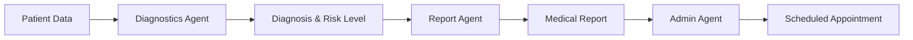

# Google-Agent2Agent-A2A-IBM-watsonx
A distributed multi-agent system for healthcare workflow automation that follows the Google A2A protocol and integrates with IBM watsonx. The system orchestrates three specialized AI agents to process patient data, generate medical reports, and schedule follow-up appointments


# 🏥 Healthcare Multi-Agent System with A2A Protocol

A sophisticated multi-agent healthcare system that orchestrates AI agents to analyze patient data, generate medical reports, and schedule follow-up appointments using the A2A (Agent-to-Agent) protocol.


## 🌟 Overview

This project demonstrates a distributed multi-agent system for healthcare workflow automation following the A2A v0.2 protocol. The system seamlessly integrates three specialized AI agents powered by IBM WatsonX and various AI frameworks to create an end-to-end healthcare automation pipeline.

### 🎯 Key Features

- **Protocol-Based Communication**: Full A2A v0.2 compliance with JSON-RPC 2.0
- **Multi-Framework Integration**: Combines Autogen, LangGraph, and BeeAI frameworks
- **Distributed Architecture**: Independently deployable microservices
- **Healthcare Workflow Automation**: From diagnosis to appointment scheduling
- **Real-time Processing**: Asynchronous operations with comprehensive error handling

## 🏗️ Architecture

```
healthcare_a2a_multiagent/
│
├── client_agent/          # Orchestrator agent (A2A Client)
│   └── workflow_client.py # Multi-agent workflow coordinator
│
├── diagnostics_agent/     # Medical diagnosis service
│   ├── server.py         # A2A-compliant REST API
│   └── diagnostics_logic.py # Autogen-based analysis
│
├── report_agent/         # Report generation service
│   ├── server.py        # A2A-compliant REST API
│   └── report_logic.py  # LangGraph-based generation
│
└── admin_agent/         # Appointment scheduling service
    ├── server.py       # A2A-compliant REST API
    └── admin_logic.py  # BeeAI-based scheduling
```

## 🚀 Workflow



### Agent Specifications

| Agent | Port | Framework | Purpose |
|-------|------|-----------|---------|
| **Diagnostics** | 8001 | Autogen + WatsonX | Analyzes symptoms and vitals to provide diagnosis |
| **Report** | 8002 | LangGraph + WatsonX | Generates structured medical reports |
| **Admin** | 8003 | BeeAI + WatsonX | Schedules follow-up appointments |

## 🛠️ Technology Stack

- **AI/LLM**: IBM WatsonX
- **Frameworks**: 
  - [Autogen](https://github.com/microsoft/autogen) - For conversational AI
  - [LangGraph](https://github.com/langchain-ai/langgraph) - For stateful workflows
  - [BeeAI](https://github.com/i-am-bee/bee-agent-framework) - For ReAct agents
- **Protocol**: A2A v0.2 (Agent-to-Agent)
- **Async**: httpx, asyncio
- **API**: Flask, JSON-RPC 2.0

## 📋 Prerequisites

- Python 3.8+
- IBM WatsonX account and credentials
- Code Interpreter service (for BeeAI agent)

## 🔧 Installation

1. **Clone the repository**
```bash
git clone https://github.com/SinghSuryaDeep/healthcare-a2a-multiagent.git
cd healthcare-a2a-multiagent
```

2. **Create virtual environment**
```bash
python -m venv venv
source venv/bin/activate  # On Windows: venv\Scripts\activate
```

3. **Install dependencies**
```bash
pip install -r requirements.txt
```

4. **Set up environment variables**
```bash
cp .env.example .env
```

Edit `.env` with your credentials:
```env
# WatsonX Configuration
WATSONX_URL=your_watsonx_url
WATSONX_PROJECT_ID=your_project_id
WATSONX_APIKEY=your_api_key
WATSONX_MODEL=your_model_id

# Code Interpreter (for Admin Agent)
CODE_INTERPRETER_URL=http://127.0.0.1:50081
CODE_INTERPRETER_SOURCE=./tmp/source
CODE_INTERPRETER_TMPDIR=./tmp/target
```

## 🚀 Running the System

1. **Start all agent servers** (in separate terminals):

```bash
# Terminal 1 - Diagnostics Agent
python diagnostics_agent/server.py

# Terminal 2 - Report Agent  
python report_agent/server.py

# Terminal 3 - Admin Agent
python admin_agent/server.py
```

2. **Run the workflow client**:
```bash
python client_agent/workflow_client.py
```

## 📊 Example Output

```
🩺 [Diagnostics] Result:
   • Condition: Hypertension with possible cardiac involvement
   • Risk Level: High

📄 [Report] Generated:
   {
     "Condition": "Hypertension with possible cardiac involvement",
     "RiskLevel": "High",
     "Recommendations": [
       "Follow up in 2 weeks",
       "Monitor vitals daily"
     ]
   }

📅 [Admin] Appointment Scheduled:
   • Date: 2025-08-09T22:33:29.424214Z
   • Link: https://calendar.google.com/calendar/event?...

✅ A2A Workflow completed successfully!
```

## 🔌 A2A Protocol Implementation

Each agent exposes:
- `/.well-known/agent.json` - Agent capability discovery
- `/skills/<skill-id>` - Skill invocation endpoints
- `/health` - Health check endpoint

### Agent Card Example
```json
{
  "apiVersion": "a2a/v0.2",
  "kind": "AgentCard",
  "metadata": {
    "id": "diagnostics-agent",
    "name": "DiagnosticsAgent",
    "description": "Analyzes patient symptoms and vitals"
  },
  "spec": {
    "skills": [{
      "id": "analyze-patient-data",
      "invocation": {
        "endpoint": "/skills/analyze-patient-data"
      }
    }]
  }
}
```

## 🧪 Testing

### Unit Tests
```bash
pytest tests/
```

### Integration Test
```bash
python tests/integration_test.py
```

### Manual Testing with cURL
```bash
# Discover agent capabilities
curl http://localhost:8001/.well-known/agent.json

# Invoke a skill
curl -X POST http://localhost:8001/skills/analyze-patient-data \
  -H "Content-Type: application/json" \
  -d '{
    "jsonrpc": "2.0",
    "method": "invoke",
    "params": {
      "patient_data": {
        "symptoms": ["headache", "fever"],
        "vitals": {"temperature": "101F"}
      }
    },
    "id": "123"
  }'
```

## 📈 Performance Considerations

- **Async Operations**: Non-blocking I/O for better scalability
- **Connection Pooling**: Reuses HTTP connections
- **Error Recovery**: Automatic retries with exponential backoff
- **Logging**: Comprehensive logging for debugging

## 🔒 Security

- Environment-based configuration
- API key authentication ready
- Input validation and sanitization
- Error messages don't leak sensitive information

## 🤝 Contributing

Contributions are welcome! Please feel free to submit a Pull Request.

1. Fork the repository
2. Create your feature branch (`git checkout -b feature/AmazingFeature`)
3. Commit your changes (`git commit -m 'Add some AmazingFeature'`)
4. Push to the branch (`git push origin feature/AmazingFeature`)
5. Open a Pull Request

## 📄 License

This project is licensed under the MIT License - see the [LICENSE](LICENSE) file for details.

## 🙏 Acknowledgments

- IBM WatsonX team for the LLM infrastructure
- Autogen, LangGraph, and BeeAI framework developers
- A2A protocol specification contributors

## 📚 Resources

- [A2A Protocol Specification](https://github.com/a2a-protocol/a2a-spec)
- [IBM WatsonX Documentation](https://www.ibm.com/docs/en/watsonx)
- [Multi-Agent Systems Guide](https://www.example.com/multi-agent-guide)

## 🚧 Roadmap

- [ ] Add authentication mechanisms
- [ ] Implement agent monitoring dashboard
- [ ] Support for multiple LLM providers
- [ ] Enhanced error recovery mechanisms
- [ ] Kubernetes deployment manifests
- [ ] Performance benchmarking suite

## 🐛 Known Issues

- Code Interpreter service must be running for Admin Agent
- Requires stable internet connection for WatsonX API calls

---

## 👨‍💻 Author

**Surya Deep Singh**

I'm passionate about building intelligent multi-agent systems and exploring the intersection of AI and distributed computing. This project represents my exploration into protocol-based agent communication and healthcare automation.

### 🔗 Connect with me:

<p align="left">
<a href="https://www.linkedin.com/in/surya-deep-singh-b9b94813a/" target="_blank">
  
</a>
<a href="https://github.com/SinghSuryaDeep" target="_blank">
  
</a>
<a href="https://medium.com/@SuryaDeepSingh" target="_blank">
  
</a>
</p>

### 📫 Let's collaborate!

I'm always interested in discussing:
- Multi-agent system architectures
- AI/ML in healthcare applications  
- Distributed system design patterns
- Open source collaboration opportunities

Feel free to reach out on any of the platforms above!

---

<p align="center">
  Made with ❤️ by Surya Deep Singh
</p>